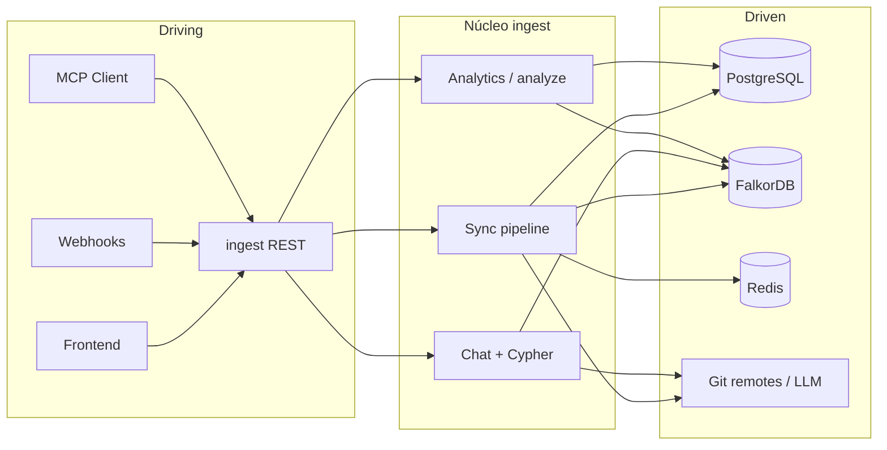

# PROJECT_CONTEXT — Ariadne / AriadneSpecs

Documento de **verdad técnica** para razonamiento en NotebookLM u otros LLM. Describe el sistema *tal como está implementado*, no un tutorial genérico de NestJS o grafos.

**Alcance del monorepo:** ingest (NestJS), api (NestJS), mcp-ariadne (MCP Oracle), orchestrator (LangGraph), frontend (React/Vite), paquete `ariadne-common` (Cypher/Falkor compartido). Infra: PostgreSQL, FalkorDB, Redis, Docker/Dokploy.

---

## 1. Architecture Blueprint (vista hexagonal adaptada)

La base no sigue carpetas `domain/` / `application/` al estilo clásico; la **separación** está por **servicios** y **capas dentro de ingest** (pipeline, dominio de repos/proyectos, chat, embedding). Aun así, el mapa hexagonal ayuda a ubicar responsabilidades.

### Driving adapters (entran comandos / eventos al sistema)

| Adapter | Rol en el negocio |
|--------|-------------------|
| **REST API `ingest`** (`services/ingest`) | CRUD proyectos, repos, dominios, credenciales; sync/resync; webhooks Bitbucket/GitHub; chat NL→Cypher; análisis por modo; embed-index; C4 y graph-routing. |
| **REST API `api`** (`services/api`) | Grafo de impacto, componente, contrato, compare, shadow; proxy hacia ingest bajo prefijo `/api` en despliegue unificado. |
| **MCP `mcp-ariadne`** | Herramientas para la IA (Cursor): grafo, búsqueda semántica, análisis de proyecto, validación antes de editar, etc. |
| **Frontend** (`frontend/`) | Gobierno de arquitectura (dominios, C4, whitelist), operación de repos y jobs, ayuda estática. |
| **Webhooks remotos** | Push de Bitbucket/GitHub → ingest encola trabajo incremental. |
| **Cola BullMQ (Redis)** | Workers de sync: procesan jobs sin bloquear la API HTTP. |

### Driven adapters (el sistema depende de ellos)

| Adapter | Rol en el negocio |
|--------|-------------------|
| **PostgreSQL + TypeORM** | Fuente de verdad relacional: repositorios, proyectos, `project_repositories`, dominios, dependencias entre dominios, credenciales cifradas, jobs de sync, espacios de embedding, etc. |
| **FalkorDB** | Grafo de código (nodos File/Component/Function/…, relaciones IMPORTS/RENDERS/CALLS/…). Particionado por `projectId` / repo; soporte **vector** (`vecf32`) para RAG si la versión de FalkorDB lo expone. |
| **Redis** | Cola BullMQ, caché de análisis y estados de agente; no es fuente de verdad del dominio. |
| **Proveedores remotos** | APIs Bitbucket/GitHub (listado de archivos, contenido, branches); Kroki (render PlantUML C4); LLM/embeddings (OpenAI/Google/Ollama según `EMBEDDING_*`). |

### Flujo de datos (alto nivel)

---

## 2. Domain Logic (conceptos que gobiernan el producto)

### Agregados / límites (lenguaje ubicuo)

- **Proyecto (multi-root):** Agrupa N repositorios; tiene `projectId` (UUID) usado por MCP y chat; puede asignarse a un **dominio de arquitectura** y declarar **dependencias a otros dominios** (whitelist para shards Cypher multi-grafo).
- **Repositorio:** Conexión a un remoto (Bitbucket/GitHub), branch por defecto, estado de sync, `credentialsRef` opcional; puede participar en varios proyectos (`project_repositories` + rol para inferencia de alcance en chat).
- **Dominio (arquitectura):** Entidad de gobierno (nombre, color, metadata); no es “dominio DDD” del código de negocio del cliente, sino **dominio de gobierno** para C4 y límites de grafo.
- **Grafo Falkor:** Modelo de código indexado por el pipeline (parser → producer Cypher); nodos tipados; embeddings opcionales por nodo para duplicados semánticos y búsqueda.
- **Job de sync:** Estado `queued` / `running` / …; full vs incremental; amarra la operación de ingesta a un repositorio.

### Reglas de negocio críticas (resumen)

- Sin **sync** reciente, el grafo y el chat no reflejan el estado del remoto.
- **Chat** y **análisis** multi-root resuelven repo/proyecto vía `AnalyticsService`, `idePath`, `repositoryId` y roles — no asumir un único `repoId` por proyecto.
- **Cypher multi-shard:** Con whitelist de dominios, el ingest expone `cypherShardContexts`; chat/MCP deben usar el `cypherProjectId` correcto por shard.
- **C4:** DSL generado en ingest, diagrama vía Kroki en frontend; modo shadow opcional para SDD visual cuando hay sesión/shadow graph.

### Value objects / identificadores (implícitos en el modelo)

- UUIDs de proyecto y repo como identidad estable en APIs y herramientas MCP.
- `projectId` en nodos del grafo alineado con el particionamiento lógico.

---

## 3. Cross-Cutting Concerns

### Seguridad

- **Auth frontend:** OTP por email → JWT; rutas protegidas en SPA (e2e puede usar `VITE_E2E_AUTH_BYPASS` solo en entornos de prueba).
- **Credenciales:** Tabla `credentials` en PostgreSQL; cifrado AES-256-GCM con `CREDENTIALS_ENCRYPTION_KEY`; tipos token / app_password / webhook_secret.
- **MCP:** No ejecuta Cypher destructivo arbitrario; herramientas acotadas a lectura/análisis y validaciones definidas en el servidor.

### Observabilidad

- Métricas Prometheus en ingest (`GET /metrics`); opción de desactivar con `METRICS_ENABLED`.
- Logs estructurados por servicio; telemetría de chat (alcance, grounding) configurable por env.

### Despliegue

- **Docker Compose** en raíz: `falkordb`, `postgres`, `redis`, servicios de aplicación; contexto de build en raíz para `packages/ariadne-common`.
- **Dokploy:** Documentado en `docs/notebooklm/DEPLOYMENT_DOKPLOY.md` (dominios, variables, imágenes).
- **FalkorDB:** Debe ser imagen compatible con vectores (`vecf32`) si se usa embed-index; Redis “pelado” no sustituye a FalkorDB.

---

## 4. Legacy Mapping (Technical Debt Areas)

Áreas donde el modelo mental “ideal” del documento histórico puede divergir del código o donde conviene refactorizar con cuidado:

| Área | Qué significa para NotebookLM / agentes |
|------|----------------------------------------|
| **Cartographer / filesystem** | El doc de arquitectura menciona evolución desde Cartographer con chokidar; el camino soportado es **ingesta remota + webhook**. Cualquier flujo basado solo en `SCAN_PATH` local es legado. |
| **Shadow SDD** | Grafo `AriadneSpecsShadow` y comparación main vs shadow: flujo potente pero sensible al orden de indexación y a la sesión; no mezclar sin `sessionId` donde el backend lo exige. |
| **Monorepo y paths** | Imports y raíces multi-repo: el MCP y el ingest resuelven por `roots[]` y rutas; no asumir una sola raíz de carpeta. |
| **Duplicados semánticos** | Dependen de **embed-index** y Falkor con vectores; si falla `vecf32`, la feature está degradada aunque el grafo textual exista. |
| **API vs ingest** | El frontend habla con la API que **reenvía** al ingest; rutas “canónicas” en docs pueden estar bajo `/api` en producción unificada. |

---

## 5. Firmas críticas (referencia mínima, no código completo)

- **Ingest:** `POST /repositories/:id/sync`, `POST /repositories/:id/resync`, `POST /repositories/:id/chat`, `POST /repositories/:id/analyze`, `POST /projects/:projectId/chat`, `POST /projects/:projectId/analyze`, `GET /projects/:id/architecture/c4`, `GET /projects/:id/graph-routing`.
- **MCP (ejemplos):** `list_known_projects`, `get_component_graph`, `get_project_analysis`, `semantic_search`, `validate_before_edit` — definición detallada en `docs/notebooklm/mcp_server_specs.md`.

---

## 6. Fuentes de verdad en el repo

| Tema | Documento / ruta |
|------|------------------|
| Arquitectura y stack | `docs/notebooklm/architecture.md` |
| Esquema DB y Cypher | `docs/notebooklm/db_schema.md` |
| Chat y análisis | `docs/notebooklm/CHAT_Y_ANALISIS.md` |
| MCP | `docs/notebooklm/mcp_server_specs.md` |
| Protocolo agentes | `AGENTS.md` |
| Índice general docs | `docs/README.md` |

---

*Generado según la regla **Documentation Agent for NotebookLM**: blueprint hexagonal, dominio, cross-cutting, legado; diagrama Mermaid; sin volcado de código.*
