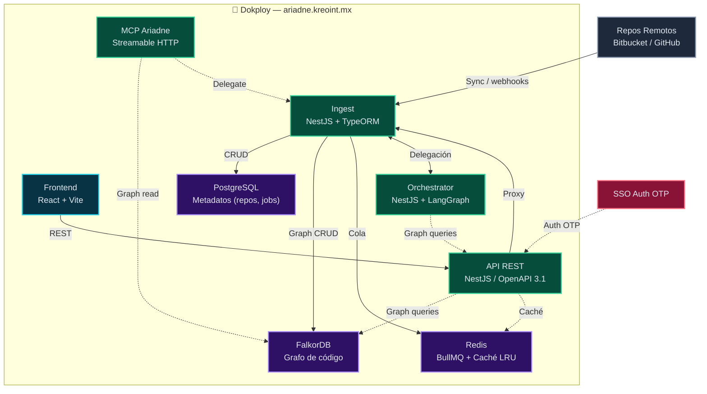

# Ariadne / AriadneSpecs

Arquitectura: **Ingest** (repos remotos + sync) + **PostgreSQL** (metadatos: repos, proyectos, **dominios de arquitectura**, whitelist proyecto→dominio) + **FalkorDB** (grafo particionado por proyecto/dominio; shadow SDD) + **Chat/Analysis** (NL→Cypher + diagnósticos) + **MCP** (herramientas para la IA) + **gobierno C4** (DSL PlantUML, preview en frontend).

## Deployment

- **ariadne.kreoint.mx** — Frontend + API (un solo dominio; rutas `/repositories`, `/graph/*` enrutadas internamente)

Ver [docs/notebooklm/DEPLOYMENT_DOKPLOY.md](docs/notebooklm/DEPLOYMENT_DOKPLOY.md).

## Servicios

- **falkordb** — Base de datos de grafos (puerto 6379).
- **ingest** — Sync repos, webhooks, shadow `POST /shadow`, índice FalkorDB (sin cartographer separado).
- **redis** — Cola BullMQ (sync) y caché (puerto 6380).
- **postgres** — Repos, sync_jobs, indexed_files, credentials (puerto 5432).
- **ingest** — NestJS: repos Bitbucket/GitHub, full sync, resync, webhook, **alcance de indexado por repo** (`index_include_rules` / UI editar repo), **Chat** (NL→Cypher), **Análisis** (diagnóstico, duplicados, reingeniería), embed-index automático (puerto 3002). Ver [docs/notebooklm/bitbucket_webhook.md](docs/notebooklm/bitbucket_webhook.md) y [MONOREPO_Y_LIMITACIONES_INDEXADO.md](docs/notebooklm/MONOREPO_Y_LIMITACIONES_INDEXADO.md).
- **api** — REST NestJS: impacto, componente, contrato, compare, shadow (puerto 3000).
- **orchestrator** — NestJS + LangGraph: validación SDD (puerto 3001).
- **mcp-ariadne** — MCP stdio: `get_component_graph`, `get_legacy_impact`, `get_contract_specs`, `semantic_search`, `get_file_content`, `validate_before_edit`, `get_project_analysis`.
- **frontend** — React+Vite: proyectos, repos, **dominios** (CRUD), detalle de proyecto (**pestaña Arquitectura**: dominio, dependencias cruzadas, **C4** vía Kroki), credenciales, **Chat con repo**, índice FalkorDB, resync (puerto 5173).

## Diagrama de Arquitectura

> 💡 Abre `docs/architecture-diagram.html` en tu navegador para ver el diagrama interactivo con colores, flechas y leyenda. Se actualiza a medida que evoluciona la arquitectura.

## Uso con Docker

1. Coloca el código a analizar en `./src` (o monta otro directorio).
2. Levanta el stack:
   - **Con Colima (local):** `pnpm run docker:up` o `pnpm run dev:infra` — usa `docker-compose.yml` + `docker-compose.dev.yml` (expone puertos para conectar desde el host).
   - **Sin script (local):** `docker compose -f docker-compose.yml -f docker-compose.dev.yml up -d`.
   - **Producción (sin puertos expuestos):** `docker compose -f docker-compose.yml up -d`.
   - Para omitir el script: `SKIP_ENSURE_DOCKER=1 <comando>`.
   - Para bajar el stack y parar Colima: `pnpm run docker:down` o `npm run docker:down`.
3. El Cartographer corre al iniciar e indexa una vez. mcp-ariadne se ejecuta con stdio (para Cursor, configura el MCP apuntando al `node dist/index.js` del servicio mcp-ariadne).

## Documentación

- [CONTRIBUTING.md](CONTRIBUTING.md) — licencia, flujo Git, migraciones, seguridad.
- [docs/JSDOC.md](docs/JSDOC.md) — convenciones JSDoc/TSDoc y mapa de entry points.
- [ariadne-common](packages/ariadne-common/README.md) — Paquete compartido (FalkorDB/Cypher) entre ingest y MCP; uso y **deployment**. (Notas largas: [docs/notebooklm/ariadne-common.md](docs/notebooklm/ariadne-common.md).)
- [Arquitectura](docs/notebooklm/architecture.md)
- [Motor de indexado](docs/notebooklm/indexing_engine.md)
- [Chat y Análisis](docs/notebooklm/CHAT_Y_ANALISIS.md) — Flujo NL→Cypher, diagnósticos, antipatrones, métricas (el retriever usa **cypherShardContexts** del ingest cuando hay whitelist de dominios)
- [Especificación MCP](docs/notebooklm/mcp_server_specs.md)
- [Esquema DB y Cypher](docs/notebooklm/db_schema.md)
- [Manual de uso](docs/manual/README.md) — Puesta en marcha, endpoints, troubleshooting
- [Caché de análisis en ingest](docs/notebooklm/plan-analyze-layer-cache.md) — LRU, Redis, capa extrínseca CALL
- [Capas del diagnóstico](docs/notebooklm/diagnostico-layer-dependencies.md) — intrínseca vs extrínseca
- [Tests (Vitest / Playwright)](docs/notebooklm/TESTING.md)

## Versionado (semver)

- Historial de producto: [CHANGELOG.md](CHANGELOG.md).
- En un **release**, alinear el campo `version` de `package.json` en la raíz, `packages/ariadne-common`, `services/ingest`, `services/api`, `services/mcp-ariadne` y `frontend` cuando el cambio forme parte del mismo entregable. Cada servicio sigue teniendo su propia imagen Docker; el número semver y el CHANGELOG documentan compatibilidad y notas de migración.

## Flujo para desarrollo local

Infraestructura (una vez): pnpm run dev:infra

- Inicia Colima si hace falta
- Sube falkordb, postgres, redis en Docker (ingest/API en el mismo compose)
- No arranca api, ingest ni orchestrator
- Servicios en local (una terminal por servicio):
  - pnpm run dev:api — API (puerto 3000) con watch
  - pnpm run dev:ingest — Ingest (puerto 3002) con watch
  - pnpm run dev:orchestrator — Orchestrator (puerto 3001) con watch
- Orden sugerido
  - pnpm run dev:infra
  - pnpm run dev:ingest (en otra terminal)
  - pnpm run dev:api (en otra terminal)
  - pnpm run dev:orchestrator (en otra terminal)
  - pnpm run dev:front (en otra terminal)

## Variables de Entorno — Referencia Completa

A continuación se listan todas las variables de entorno organizadas por servicio y categoría. Los valores por defecto mostrados aplican al `docker-compose.yml` — en Dokploy puedes sobrescribirlos en la sección **Environment** de cada servicio.

---

### 🔷 Core — Compartidas entre servicios

| Variable | Default | Servicios | Qué hace |
|---|---|---|---|
| `FALKORDB_HOST` | `falkordb` | ingest, api, mcp-ariadne | Host de FalkorDB |
| `FALKORDB_PORT` | `6379` | ingest, api, mcp-ariadne | Puerto de FalkorDB |
| `REDIS_URL` | `redis://redis:6379` | ingest, api, orchestrator | Redis para cola BullMQ (ingest), caché (api, orchestrator) |
| `CORS_ORIGIN` | — | ingest, api | Origen permitido para CORS (ej. `https://ariadne.kreoint.mx`) |
| `LLM_API_KEY` | — | ingest, orchestrator | **Clave única para LLM** (OpenRouter, LemonData, etc.). Unifica OPENROUTER_API_KEY, AI_API_KEY, OPENAI_API_KEY. |
| `LLM_PROVIDER` | `openrouter` | ingest, orchestrator | **Proveedor LLM.** Default: `openrouter`. Para migrar a LemonData: cambiar aquí. |
| `LLM_MODEL` | — | ingest, orchestrator | Modelo único de chat. Prioridad 2 tras `LLM_MODEL_INGEST` / `ORCHESTRATOR_LLM_MODEL`. |
| `LLM_MODEL_INGEST` | — | ingest | **Modelo específico para ingest.** Prioridad sobre `LLM_MODEL`. |
| `ORCHESTRATOR_LLM_MODEL` | — | orchestrator | **Modelo específico para orquestador.** Prioridad sobre `LLM_MODEL`. |
| `LLM_TEMPERATURE` | `0.1` | ingest, orchestrator | Temperatura del LLM |
| `LLM_BASE_URL` | `https://openrouter.ai/api/v1` | ingest, orchestrator | URL base de OpenRouter (válido mientras `LLM_PROVIDER=openrouter`) |
| `LLM_CHAT_MODEL` | `nousresearch/hermes-3-llama-3.1-405b` | ingest, orchestrator | Modelo de chat (fallback global) |
| `LLM_EMBEDDING_MODEL` | `openai/text-embedding-3-small` | ingest | Modelo de embeddings |
| `LLM_EMBEDDING_DIM` | `1536` | ingest | Dimensión de vectores de embedding |
| `LLM_HTTP_REFERER` | — | ingest, orchestrator | HTTP Referer para OpenRouter |
| `LLM_APP_TITLE` | — | ingest, orchestrator | Título de app para OpenRouter |
| `EMBEDDING_PROVIDER` | `openrouter` | ingest | Proveedor de embeddings (`openrouter` o `openai`) |
| `INGEST_URL` | `http://ingest:3002` | api, orchestrator, mcp-ariadne | URL del servicio ingest (para delegar consultas de grafo) |

---

### 🔷 FalkorDB & Sharding (ingest + api + mcp-ariadne)

Estas variables controlan cómo se particionan los datos entre grafos FalkorDB.

| Variable | Default | Servicios | Qué hace |
|---|---|---|---|
| `FALKOR_SHARD_BY_PROJECT` | `false` | ingest, api, mcp-ariadne | **`true`:** un grafo Falkor separado por proyecto (`AriadneSpecs:<uuid>`). Necesario para +3 proyectos medianos o uno solo >80k nodos. **`false` (default):** todo en el grafo monolítico `AriadneSpecs`. Más simple, sin riesgo de consulta en shard equivocado. |
| `FALKOR_SHARD_BY_DOMAIN` | `false` | ingest, api, mcp-ariadne | **`true`:** sub-partición del proyecto por primer segmento de ruta (`apps/` → `AriadneSpecs:<uuid>:apps`). Requiere `FALKOR_SHARD_BY_PROJECT=true`. Para monorepos enormes. |
| `FALKOR_AUTO_DOMAIN_OVERFLOW` | `false` | ingest, api | **`true`:** si el grafo supera `FALKOR_GRAPH_NODE_SOFT_LIMIT`, actualiza automáticamente el modo a `domain`. Requiere **resync** posterior. |
| `FALKOR_GRAPH_NODE_SOFT_LIMIT` | `100000` | ingest, api | Umbral de nodos por grafo para el overflow automático |
| `FALKOR_FLUSH_ALL_ONCE` | — | ingest | **`1`/`true`:** vacía FalkorDB (FLUSHALL) **solo el primer arranque**. Guarda marca en Postgres para no repetir. Para otro reset: borrar flag en BD. |
| `FALKORDB_BATCH_SIZE` | `500` | ingest | Tamaño de batch para operaciones Cypher por lote |
| `FALKOR_DEBUG_CYPHER` | — | api | **`1`:** habilita Cypher debug en el explorador de grafo (`POST /api/graph/falkor-debug-query`) |

---

### 🔷 Ingest (microservicio de ingesta — puerto 3002)

| Variable | Default | Qué hace |
|---|---|---|
| `PORT` | `3002` | Puerto HTTP del servicio |
| `PGHOST` | `postgres` | Host PostgreSQL |
| `PGPORT` | `5432` | Puerto PostgreSQL |
| `PGUSER` | `falkorspecs` | Usuario PostgreSQL |
| `PGPASSWORD` | `falkorspecs` | Contraseña PostgreSQL |
| `PGDATABASE` | `falkorspecs` | Base de datos PostgreSQL |
| `INGEST_SKIP_MIGRATIONS` | — | **`1`/`true`:** omite migraciones al arrancar (solo emergencia) |
| `NODE_ENV` | `production` | Si no es `production`, TypeORM usa `synchronize: true` |
| `CREDENTIALS_ENCRYPTION_KEY` | — | Clave 32-bytes base64 para cifrar credenciales en BD (obligatorio si usas credenciales) |
| `GITHUB_TOKEN` | — | Token GitHub (fallback si no hay `credentialsRef` en BD) |
| `BITBUCKET_TOKEN` / `BITBUCKET_APP_PASSWORD` | — | Token Bitbucket (fallback) |
| `CHAT_TELEMETRY_LOG` | `0` | **`1`/`true`:** log JSON por request del pipeline (tamaños, pathGroundingRatio) |
| `METRICS_ENABLED` | `true` | **`0`/`false`:** desactiva Prometheus (`GET /metrics` responde 503) |
| `CHAT_TWO_PHASE` | `1` (activo) | **`0`/`false`/`off`:** desactiva el bloque JSON de retrieval en el sintetizador |
| `CHAT_EVIDENCE_FIRST_MAX_CHARS` | `18000` | Tope de caracteres del contexto hacia el builder MDD en modo `evidence_first` (mín. 4000, máx. 100000) |
| `CHAT_TOOL_CALL_MAX_TOKENS` | `8192` | `max_tokens` para tool_calls del retriever |
| `MODIFICATION_PLAN_MAX_FILES` | `150` | Tope de entradas en `get_modification_plan` (máx. 2000) |
| `INDEX_TESTS` | — | **`1`/`true`:** incluir `*.test.*` y `*.spec.*` en el indexado (default: excluidos) |
| `INDEX_E2E` | — | **`1`/`true`:** incluir carpetas e2e/cypress/playwright y `*.e2e.*` (default: excluidos) |
| `INDEX_MIGRATIONS` | — | **`1`/`true`:** incluir rutas bajo `migrations/` (default: excluidos — suelen añadir ruido) |
| `TRUNCATE_PARSE_MAX_BYTES` | `25000` | Límite de bytes para truncar archivos grandes antes de parsear |
| `KROKI_URL` | `https://kroki.io` | URL base de Kroki para renderizar diagramas C4 (puede ser interna sin internet) |
| `DOMAIN_COMPONENT_PATTERNS` / `DOMAIN_CONST_NAMES` | — | Fallback global si el proyecto no tiene domain_config |
| `ORCHESTRATOR_URL` | `http://orchestrator:3001` | URL del orquestador LangGraph. Si está definido, el chat delega en él |

---

### 🔷 API REST (NestJS — puerto 3000)

| Variable | Default | Qué hace |
|---|---|---|
| `PORT` | `3000` | Puerto HTTP |
| `JWT_SECRET` | — | **Obligatorio en producción.** Secreto para firmar tokens JWT (auth OTP) |
| `JWT_EXPIRES` | `604800` | Tiempo de expiración del JWT en segundos (default: 7 días) |
| `EMAIL_OTP` | — | **Whitelist:** si se define, solo ese email puede solicitar OTP |
| `OTP_DEV_MODE` | — | **`true`:** devuelve el código OTP en la respuesta (solo desarrollo) |
| `SMTP_HOST` | — | Host SMTP para envío de OTP por correo |
| `SMTP_PORT` | — | Puerto SMTP (ej. 587) |
| `SMTP_USER` | — | Usuario SMTP |
| `SMTP_PASS` | — | Contraseña SMTP |
| `SMTP_FROM` | — | Remitente del correo OTP |
| `ARIADNE_API_URL` | — | URL de la API (para el explorador de grafo: component graph, impacto, C4) |
| `ARIADNE_API_BEARER` / `ARIADNE_API_JWT` | — | Token JWT para autenticarse contra la API en rutas protegidas |

---

### 🔷 Orchestrator (NestJS + LangGraph — puerto 3001)

| Variable | Default | Qué hace |
|---|---|---|
| `PORT` | `3001` | Puerto HTTP |
| `ARIADNESPEC_API_URL` | `http://api:3000/api` | URL de la API REST para consultas de grafo |
| `ORCHESTRATOR_LLM_MODEL` | — | Modelo específico para el orquestador. Ver tabla Core arriba. |

---

### 🔷 MCP Ariadne (Streamable HTTP — puerto 8080)

| Variable | Default | Qué hace |
|---|---|---|
| `PORT` | `8080` | Puerto HTTP del servidor MCP |
| `MCP_AUTH_TOKEN` | — | **Token M2M opcional.** Si se define, exige `Authorization: Bearer <token>` en cada request al MCP |
| `MCP_ASK_CODEBASE_TIMEOUT_MS` | `300000` (300s) | Timeout del fetch hacia ingest en `ask_codebase`. Con `raw_evidence`: 900s |
| `MCP_ASK_CODEBASE_PROGRESS_LOG_MS` | `60000` | Intervalo en ms entre logs de progreso de `ask_codebase` (0 = desactivado) |
| `MCP_TOOL_LOG` | `1` (activo) | **`0`:** desactiva logs detallados de invocación de herramientas |
| `MCP_TOOL_LOG_ARG_MAX` | `12000` | Tamaño máximo de línea en log de herramientas |
| `MCP_TOOL_LOG_RESPONSE_BLOCK_MAX` | — | Tope por bloque de contenido en log de respuesta |
| `MCP_TOOL_LOG_RESPONSE_TOTAL_MAX` | — | Tope total de respuesta en log |
| `MCP_SEMANTIC_SEARCH_DEFAULT` | — | Límite default para semantic_search |
| `MCP_SEMANTIC_SEARCH_MAX` | — | Límite máximo para semantic_search |
| `MCP_SEMANTIC_SEARCH_VECTOR_K_MAX` | — | Máximo de vecinos vectoriales en semantic_search |
| `MCP_FILE_CONTEXT_MAX_CHARS` | — | Tope de caracteres en `get_file_context` |
| `MCP_AFFECTED_NODES_MAX` / `MCP_AFFECTED_FILES_MAX` | — | Topes para `get_affected_scopes` |
| `MCP_UNUSED_EXPORTS_MAX` | — | Tope para `check_export_usage` |
| `MCP_TRACE_*` | — | Varias: topes para `trace_reachability` |
| `MCP_FIND_SIMILAR_*` | — | Varias: topes para `find_similar_implementations` |
| `MCP_SYNC_STATUS_RECENT_JOBS_MAX` | — | Jobs recientes en `get_sync_status` |

> 💡 Todos los límites MCP tienen defaults altos para información completa. Puedes **bajarlos** si saturan el contexto del LLM o el tiempo de respuesta de Falkor.

---

### 🔷 Frontend (React + Vite)

| Variable | Default | Qué hace |
|---|---|---|
| `VITE_API_URL` | `http://localhost:3002` (dev) / `https://ariadne.kreoint.mx` (prod) | URL base del backend (API/Ingest). Sin trailing slash. |
| `VITE_SSO_BASE_URL` | — | URL base del SSO (opcional; si no se define, la app funciona sin auth) |
| `VITE_SSO_APPLICATION_ID` | — | UUID de la aplicación en SSO (opcional) |
| `VITE_SSO_FRONTEND_URL` | — | URL del frontend SSO para redirección (opcional) |

> `VITE_*` se pasan como **build args** en el Dockerfile, no como env runtime. Se inyectan al construir la imagen. Si cambias estos valores, rebuild de la imagen.

---

### Resumen rápido para producción (Dokploy)

Las únicas **obligatorias** en Dokploy son:

| Servicio | Variables requeridas |
|---|---|
| **ingest** | `LLM_API_KEY`, `LLM_PROVIDER`, `CREDENTIALS_ENCRYPTION_KEY` |
| **api** | `JWT_SECRET` |
| **mcp-ariadne** | _Ninguna obligatoria_ (opcional: `MCP_AUTH_TOKEN`) |
| **orchestrator** | `LLM_API_KEY`, `LLM_PROVIDER` |
| **frontend** | `VITE_API_URL` (build arg) |

> 💡 **Modelos LLM por componente:** `LLM_MODEL_INGEST` para ingest y `ORCHESTRATOR_LLM_MODEL` para el orquestador. Si no se definen, usan `LLM_MODEL` → `LLM_CHAT_MODEL` → default (`nousresearch/hermes-3-llama-3.1-405b`).
> `LLM_PROVIDER` = `openrouter` por defecto. `LLM_API_KEY` es la única clave — no se usan `OPENROUTER_API_KEY`, `AI_API_KEY` ni `OPENAI_API_KEY`. Para migrar a LemonData solo se cambia `LLM_PROVIDER` y se actualiza `LLM_API_KEY`.

Todo lo demás tiene defaults funcionales en `docker-compose.yml`.

---

## Licencia y autoría

- **Licencia:** [Apache License 2.0](LICENSE). Aviso de terceros y copyright del proyecto: [NOTICE](NOTICE).
- **Autores y colaboradores:** [AUTHORS.md](AUTHORS.md) (autor principal: Jorge Correa; sección *Contributors* para quien sume al repo).
- **Cómo contribuir y JSDoc:** [CONTRIBUTING.md](CONTRIBUTING.md) y [docs/JSDOC.md](docs/JSDOC.md).
