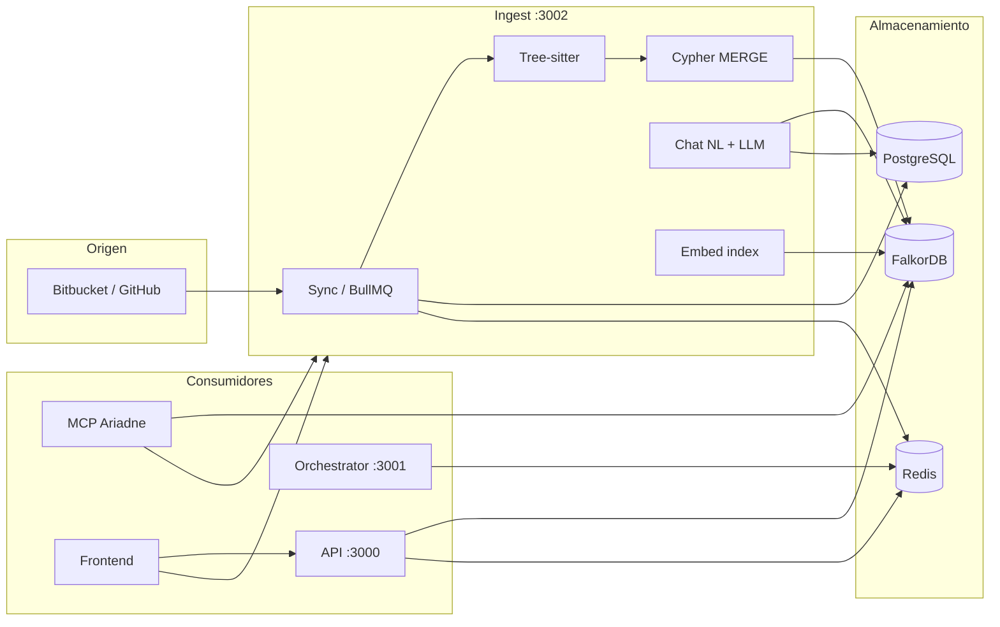
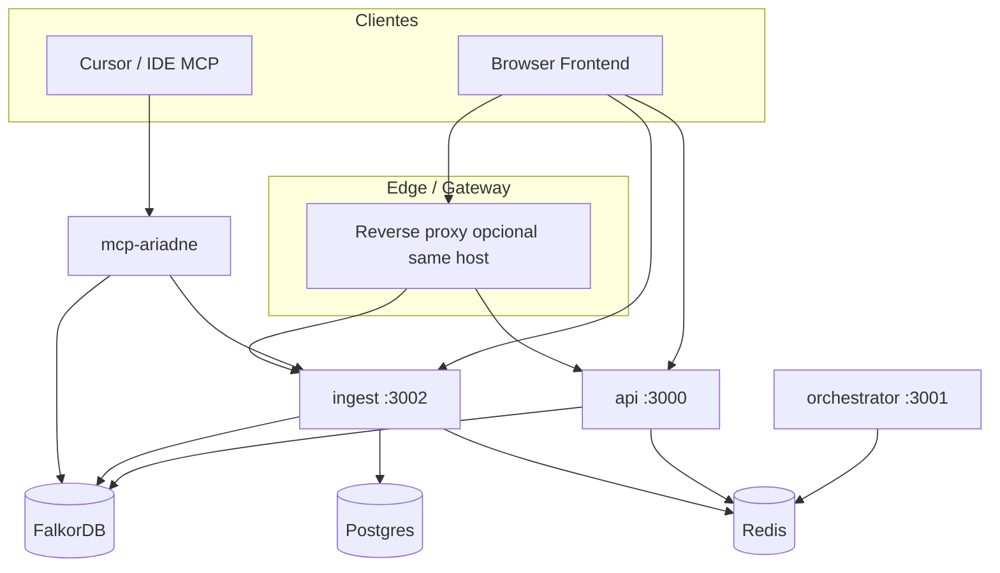

# PROJECT_BRAIN_DUMP — Ariadne / AriadneSpecs

> **Propósito del documento:** fuente de verdad técnica para un cuaderno **NotebookLM**. Describe el monorepo real (no proyectos de clientes indexados en Falkor).  
> **Última revisión según árbol de código:** abril 2026.

---

## Executive Summary

**Ariadne (AriadneSpecs)** es una plataforma para **indexar repositorios remotos** (Bitbucket, GitHub), **materializar un grafo de código** en **FalkorDB** (componentes, archivos, funciones, rutas Nest, modelos, dependencias) y **consultar ese conocimiento** vía REST, chat NL→Cypher, análisis (deuda, duplicados, seguridad heurística) y **MCP** (Model Context Protocol) para IDEs como **Cursor**.

**No incluye Google Antigravity** como dependencia ni módulo. La integración “agentic” es: **Cursor (u otro host MCP)** + **servidor `mcp-ariadne`** + opcionalmente **orquestador LangGraph** para flujos SDD y **chat agéntico** en el servicio **ingest** (ReAct / herramientas Cypher).

**Problema central que resuelve:** dar a la IA **contexto estructurado y verificable** (grafo + contratos + impacto) antes de refactorizar código legacy, en lugar de confiar solo en lectura plana de archivos.

---

## Deep Dive Arquitectónico

### Patrón de diseño

- **Microservicios + monorepo:** cada servicio es una app **NestJS** (salvo frontend React y MCP Node).
- **Persistencia dual:** **PostgreSQL** (metadatos, colas, credenciales cifradas) + **FalkorDB** (grafo en memoria con snapshot).
- **Colas:** **Redis + BullMQ** para trabajos de sync en ingest.
- **Hexagonal / limpio “light”:** dominio de sync y grafo separado en módulos Nest; adaptadores hacia Bitbucket/GitHub API, Falkor, OpenAI/Google embeddings.

No es MVC clásico: es **API + workers + graph DB + MCP**.

### Estructura de carpetas (nivel raíz)

| Ruta | Rol |
|------|-----|
| `packages/ariadne-common` | Tipos y utilidades Cypher/Falkor compartidas (ingest, MCP). |
| `services/ingest` | Sync repos, webhooks, chat, embeddings, análisis por repo/proyecto, shadow. |
| `services/api` | REST grafo: impacto, componente, contrato, compare, proxy/OpenAPI según despliegue. |
| `services/orchestrator` | LangGraph + Redis: flujos de validación SDD (refactor). |
| `services/mcp-ariadne` | Servidor MCP (tools → Falkor + ingest HTTP). |
| `services/cartographer` | Legacy / shadow según docs; ingest asume pipeline principal remoto. |
| `frontend` | Vite + React 19: shell con sidebar (Gobierno / Ingeniería / Plataforma), repos, jobs, credenciales, chat por repo/proyecto, C4, explorador de grafo (React Flow). |
| `docs/` | Arquitectura, MCP, chat, despliegue, esquema DB. |

### Flujo de datos principal

### Capas lógicas

1. **Ingesta:** clon/API → parse → producción de nodos/aristas (`:File`, `:Component`, `:Function`, `:Route`, `:Model`, relaciones `IMPORTS`, `RENDERS`, `depends`, etc.).
2. **Consulta:** Cypher directa, chat con herramientas, MCP tools tipadas.
3. **Presentación / agentes:** frontend humano + LLM vía ingest + validación LangGraph opcional.

---

## Stack Tecnológico

### Runtime y lenguajes

- **Node.js ≥ 20**, **TypeScript** 5.7–5.9 según paquete.

### Backend (por servicio)

| Componente | Dependencias clave (referencia `package.json`) |
|------------|--------------------------------------------------|
| **ingest** | NestJS 10, TypeORM 0.3, `falkordb` 6, `bullmq` 5.7, `ioredis`, `tree-sitter` + `tree-sitter-typescript` / `javascript`, `pg`, `@prisma/internals` |
| **api** | NestJS 10, `falkordb` 6, `redis` 4.7, `jsonwebtoken`, `http-proxy-middleware` |
| **orchestrator** | NestJS 10, `@langchain/langgraph` 0.2, `@langchain/core` 0.3, `redis` 4.7 |
| **mcp-ariadne** | `@modelcontextprotocol/sdk` 1.x, `falkordb` 6, `ariadne-common` |
| **ariadne-common** | Solo TS (empaquetado `dist/`) |

### Frontend

- **React 19.2**, **Vite 7.3**, **react-router-dom** 7.13, **Tailwind** 4.2, **radix-ui**, **@xyflow/react** 12.10 (grafo), **marked** / **react-markdown**, **lucide-react**.

### Bases de datos y infra

| Store | Uso |
|-------|-----|
| **PostgreSQL** | `projects`, `repositories`, `project_repositories`, `sync_jobs`, `indexed_files`, `credentials` (cifrado), etc. |
| **FalkorDB** | Grafo de código; soporte **vector** (`vecf32`, índices) para embeddings en nodos `Function`, `Component`, `Document`. |
| **Redis** | Cola BullMQ, caché API/ingest, estado orchestrator. |

### Servicios externos y agentic AI

| Integración | Config típica |
|-------------|---------------|
| **OpenAI** | `OPENAI_API_KEY` — chat (`chat-llm.service`), embeddings opcionales. |
| **Embeddings** | `EMBEDDING_PROVIDER=openai|google` + `OPENAI_API_KEY` o `GOOGLE_API_KEY`; endpoint ingest `POST /embed`, `POST /repositories/:id/embed-index`. |
| **Bitbucket / GitHub** | Tokens en BD (`credentials`) o env; webhooks Bitbucket → ingest. |
| **MCP** | Cursor/IDE: `mcp-ariadne` con `INGEST_URL`, `FALKORDB_*`, opcional `MCP_AUTH_TOKEN`. |

**Google Antigravity:** no aparece en el código ni en dependencias. Si en el futuro un IDE usa Antigravity de forma similar a Cursor, el **contrato** sigue siendo MCP + HTTP hacia ingest/API.

---

## Inventario de Funcionalidades

| Funcionalidad | Problema que resuelve | Archivos / módulos principales | Lógica principal |
|---------------|----------------------|--------------------------------|------------------|
| **Sync de repositorio** | Mantener grafo alineado al repo remoto | `services/ingest/src/sync/*`, `repositories/*` | Jobs BullMQ, clone/API, pipeline Tree-sitter → Cypher |
| **Proyectos multi-root** | Un proyecto Ariadne = varios repos | `projects/*`, `project-repository.entity` | `projectId` en nodos Falkor; resync por proyecto |
| **Webhook Bitbucket** | Incremental en push | `webhooks/*` | Dispara sync/diff según commit |
| **Chat con repo** | Preguntas NL sin escribir Cypher | `ingest/src/chat/*` | Retriever (Cypher, archivos, `semantic_search` interno) + sintetizador LLM |
| **Análisis de proyecto** | Deuda, duplicados, código muerto, seguridad heurística | `ChatController` / `ProjectChatController` `analyze`, `analytics.service.ts`, `chat.service.ts` | `POST /repositories/:id/analyze` (repo) y `POST /projects/:id/analyze` (resolución multi-root `AnalyticsService`); modos incl. `seguridad`; duplicados usa embeddings |
| **Embed index** | Búsqueda semántica y duplicados | `embedding/*`, `embed-index.service.ts` | Vector index Falkor; proveedor OpenAI/Google |
| **Shadow graph** | Comparar main vs borrador (SDD) | `shadow/*`, API compare | Grafo sombra + diff de props |
| **API grafo** | Impacto y contexto para herramientas no-MCP | `services/api/src/graph/*` | `getComponent`, `getImpact`, contrato, compare |
| **MCP Oracle** | Herramientas tipadas para la IA | `services/mcp-ariadne/src/index.ts` | `get_component_graph`, `semantic_search`, `get_file_content`, `get_project_analysis`, … |
| **Orchestrator** | Flujo multi-paso validación refactor | `services/orchestrator` LangGraph | Estado en Redis, nodos de workflow |
| **Frontend repos** | Operar sync, credenciales, chat | `frontend/src/pages/*`, `api.ts` | Llama ingest y API |
| **Explorador de grafo** | Ver depends / legacy_impact | `frontend/src/pages/ComponentGraph/*` | React Flow + API `getComponentGraph` |

---

## Grafo de Dependencias (servicios)

**Comunicación resumida:**

- **ingest ↔ Falkor:** lectura/escritura Cypher (sync, chat, análisis, embed).
- **api ↔ Falkor:** consultas de grafo con caché Redis.
- **mcp-ariadne ↔ Falkor:** queries directas; **mcp ↔ ingest:** `get_file_content`, `get_project_analysis`, `/embed`, etc. (según tool).
- **orchestrator:** principalmente Redis + HTTP hacia API/ingest en flujos de validación (según configuración desplegada).

---

## Reglas de Negocio Críticas (embebidas en código)

1. **Sharding por proyecto:** con `FALKOR_SHARD_BY_PROJECT` (y flags en `ariadne-common`), muchas herramientas MCP y consultas exigen **`projectId`** explícito para no mezclar grafos.
2. **Credenciales:** almacenadas cifradas (AES-256-GCM) en PostgreSQL; clave maestra `CREDENTIALS_ENCRYPTION_KEY`. Repos referencian `credentialsRef`.
3. **Unicidad y límites de grafo:** nodos llevan `projectId` / `repoId` según modelo; pruning de carpetas (`node_modules`, `dist`, …) para tamaño del grafo.
4. **Component graph API:** aristas `depends` (árbol de dependencias) + `legacy_impact` (consumidores vía patrones tipo `CALLS`/`RENDERS`); normalización de celdas Falkor evita `String(object)` → `[object Object]` en IDs.
5. **Chat:** si no hay `OPENAI_API_KEY`, el chat degradará o error explícito; Cypher generado se ejecuta con límites y retries según handlers.
6. **Búsqueda semántica MCP:** combina vector (si `/embed` + índice) y fallback por **tokens** en labels del grafo (no solo frase literal completa).
7. **MCP auth:** opcional `MCP_AUTH_TOKEN` en despliegues expuestos.

---

## Puntos de Extensión y Refactorización

| Área | Estado / oportunidad |
|------|----------------------|
| **cartographer** | Documentado como legacy frente a ingest remoto; clarificar qué queda solo para shadow. |
| **GitHub vs Bitbucket** | Módulos `providers`; extender cobertura y paridad webhook. |
| **Orchestrator vs ingest** | Dos sitios con lógica “agentic”; unificar criterios SDD o documentar cuándo usar cada uno. |
| **Vector dimensions** | Cambiar proveedor de embedding implica **reconstruir** índice vectorial Falkor. |
| **Frontend bundle** | React Flow aumenta tamaño; code-split en ruta `/graph-explorer`. |
| **Tests E2E** | Mayor cobertura en sync + MCP contract tests. |

---

## Preguntas Abiertas (para debatir con NotebookLM)

1. **¿Cuándo priorizar chat ingest vs MCP `ask_codebase` vs Cursor nativo?** Criterios de coste, latencia y trazabilidad.
2. **Estrategia de multi-tenancy:** un Falkor por tenant vs grafo único con `projectId` estricto — límites de memoria y backup.
3. **Modelo de amenaza MCP HTTP:** JWT, rate limit, auditoría de herramientas peligrosas (si se añaden).
4. **Unificación del “manual de componentes”** (`getManual`) con export estático para NotebookLM sin pasar por LLM.
5. **Observabilidad:** métricas `prom-client` en ingest — qué SLIs definir para sync y para latencia Cypher.
6. **Ingest de lenguajes:** solo TS/JS vía Tree-sitter hoy en el núcleo; roadmap para otros tipos de nodo.
7. **Comparación con Antigravity / otros IDE agents:** mismo MCP es suficiente; ¿hace falta capa OAuth distinta por proveedor?

---

## Referencias internas (lectura)

- `README.md` — visión general y scripts Docker.
- `docs/notebooklm/architecture.md` — stack objetivo y flujos SDD/shadow.
- `docs/notebooklm/mcp_server_specs.md` — contrato MCP.
- `docs/notebooklm/CHAT_Y_ANALISIS.md` — NL→Cypher y modos de análisis.
- `docs/notebooklm/db_schema.md` — nodos Falkor y tablas PostgreSQL.
- `AGENTS.md` / `.cursor/rules` — protocolo para usar el MCP sin alucinar nodos.

---

*Fin del brain dump — mantener alineado con cambios en `services/*` y `packages/ariadne-common`.*
